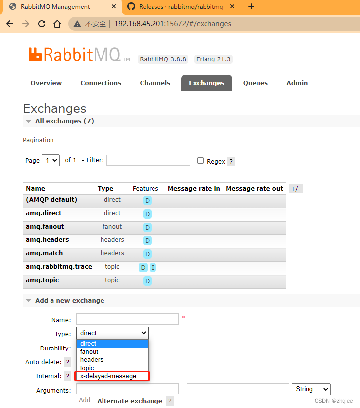
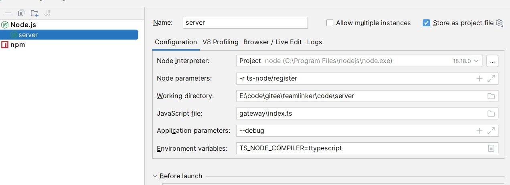

## 📝Local deployment

If you want to deploy locally

The software environments below you need to install first:
* Redis recommended version 5.0+
* Rabbitmq recommended version 3.8+,
* Mysql recommended version 5.7+
* Nodejs recommended version 18+
* Vue recommended version 3.0+

🚧 Note: Rabbitmq needs to install the message delay queue plugin

### Message delay queue plug-in installation
1. Download

Official website download address: https://www.rabbitmq.com/community-plugins.html

We also provide download [message delayed queue plug-in package](./file/rabbitmq_delayed_message_exchange-3.8.0.ez)

🚧 Note: Select the corresponding version

2. Add to the `plgins` directory

For example, if we put it in this directory
```bash
/usr/lib/rabbitmq/lib/rabbitmq_server-3.8.0/plugins
```

3. Installation
```bash
cd /usr/lib/rabbitmq/lib/rabbitmq_server-3.8.0/plugins
rabbitmq-plugins enable rabbitmq_delayed_message_exchange
systemctl restart rabbitmq-server
```
Log in to rabbitmq again. If `x-delayed-message` appears in the exchange type, it means that the plug-in is installed successfully!



### Server configuration file
Let’s introduce the configuration file to you:

Configuration file location `code/server/teamlinker.config.json`

Redis configuration
```bash
"redis":{
    "url":"localhost",
    "port":6379,
    "db":0,
    "password":""
}
```

Mysql configuration
```bash
"mysql":{
    "url":"localhost",
    "port":3306,
    "database":"teamlinker_dev",
    "username":"root",
    "password":"123456"
}
```

Rabbitmq configuration
```bash
"mq": "amqp://127.0.0.1"
```


### Install dependencies
1. Switch to the `teamlinker` project root directory

Then install the dependencies
```
npm install
```

### Server deployment

2. Switch to the `code/server` directory

Then install the dependencies
```
npm install
```
Start backend


### Client deployment
3. Switch to the `code/client` directory

Then install the dependencies
```
npm install
```
Start service
```
npm run dev
```
🚧 Note: Port modification `code/client/vite.config.ts` `port` configuration item default is `3000`