

  

<h3 align="center">
企业用户团队协作解决方案
</h3>
<h4 align="center">
团队协作从未如此轻松
</h4>

## 📝 介绍
Teamlinker是一个集成了多功能模块的团队协作平台，涵盖团队成员联系、任务分配、会议开启、事务安排以及文件管理等方面。

该平台解决了团队内高效协作的难题，避免了公司使用多个工具分别处理项目进程、同事交流和客户会议的问题。相较于传统工具，Teamlinker不仅提供基本而全面的协同办公需求，而且成本极低，更符合当前经济环境。

Teamlinker基于TeamOS系统开发，是一种web操作系统，用户可以并行处理不同任务，类似于Win和Mac等操作系统。主要包含六个功能模块：项目、Wiki、日历、会议、聊天和网盘，这些功能之间无缝整合，使团队协作更加顺畅。
### 用心做开源，我们也很需要你的鼓励！右上角Star🌟，等你点亮！

## 📋 官网

https://team-linker.com

## 📋 文档
简体中文 https://team-linker.com/doc/zh/

## 🕐︎ 功能特点
* 完全采用TypeScript开发，后端使用Node.js，前端使用Vue3。
* 从零开始打造了一个Web OS系统，实现了桌面管理、多窗口、多任务、文件拖放、上传和下载等功能。
* 利用WebRtc实现了多人视频和语音传输，包括成员邀请、屏幕共享、虚拟背景、视频虚化等功能。同时，实现了会议管理员控制和会议内聊天功能。
* 基于HTMLElement的contentEditable开发了块编辑器，支持自由排版、颜色和字体调整、链接和图片插入，以及附件添加和快捷方式。
* 项目管理模块支持自定义工作项类型、工作流、字段、看板和甘特图管理等常用项目管理功能，完全使用纯JavaScript开发，可单独提取为模块使用。
* 日历部分实现了多日历管理、多时区切换、自由切换日、周和月视图状态，支持全天和重复日历事件，并利用RabbitMQ实现了日历事件提醒功能。
* IM功能利用Socket.IO实现了在消息组内@所有人或指定成员、消息收藏和搜索，还包括快速视频会议等功能。
* 即将推出的AI功能，利用NLP技术和Transformers框架打造私人工作小助理，为你提供个性化服务。

## 📲 核心架构

  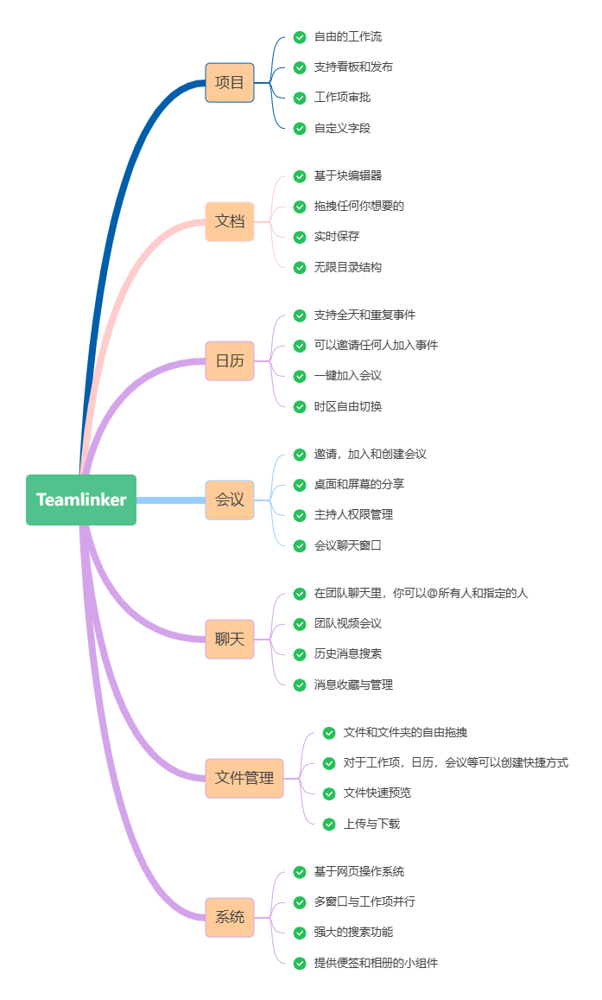

## 🔐 安装
[安装教程](./INSTALL-ZH-CN.md)

## 💻 本地部署
[本地部署](./DEV-README-ZH-CN.md)

## 📱 在线演示
项目

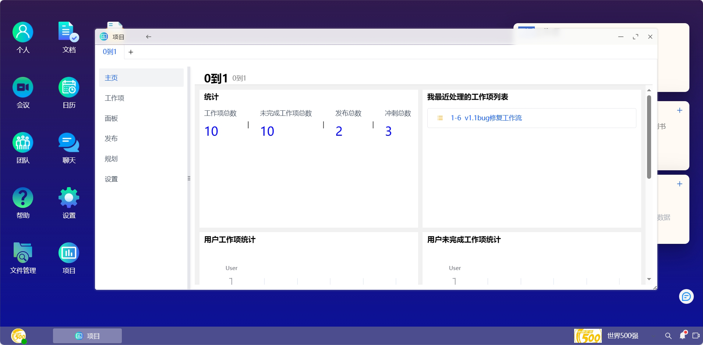
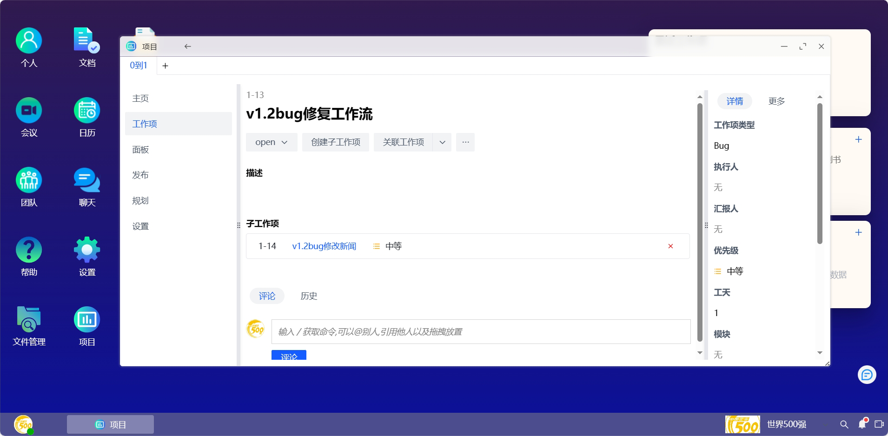
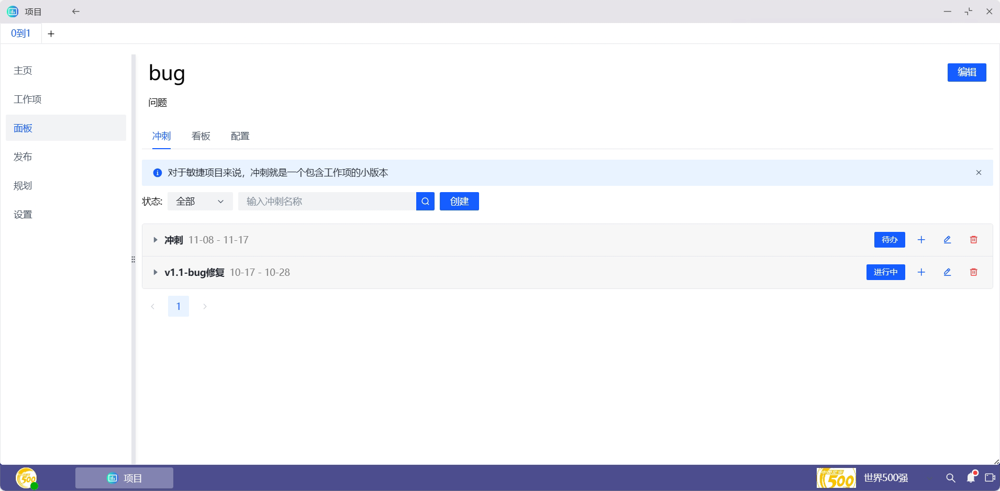
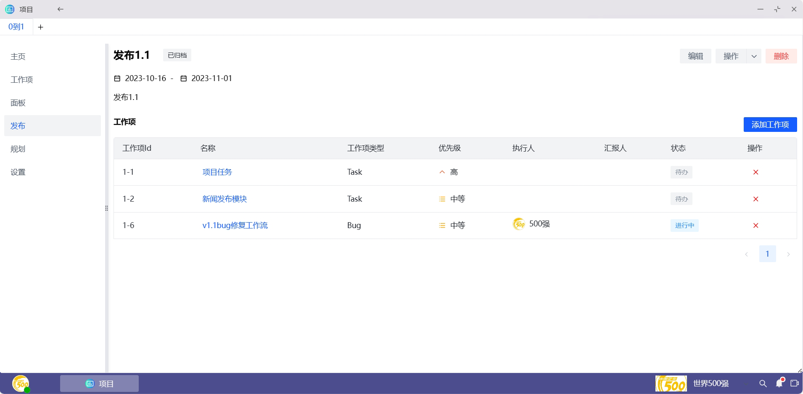
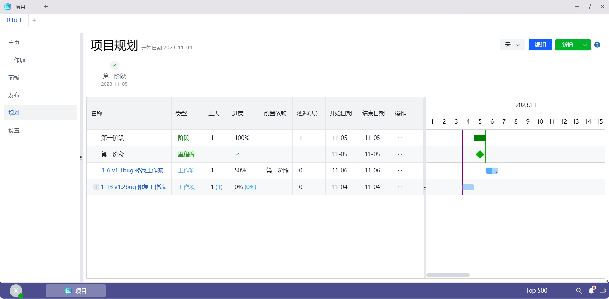

文档

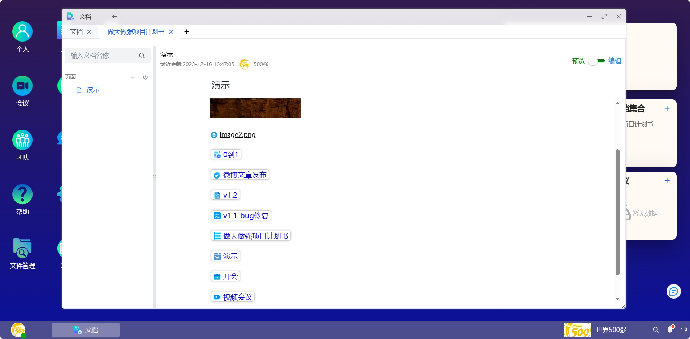

日历

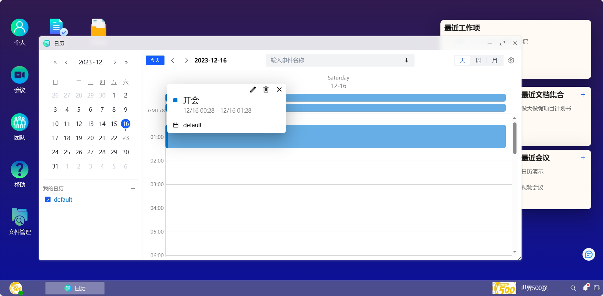
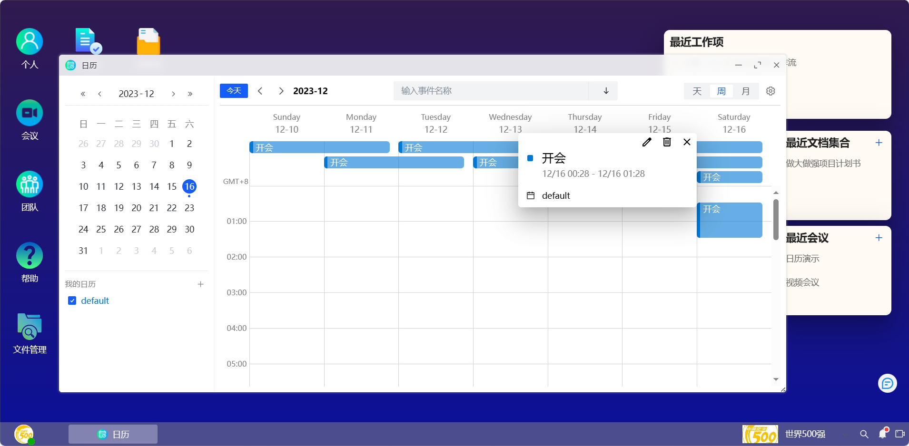

会议

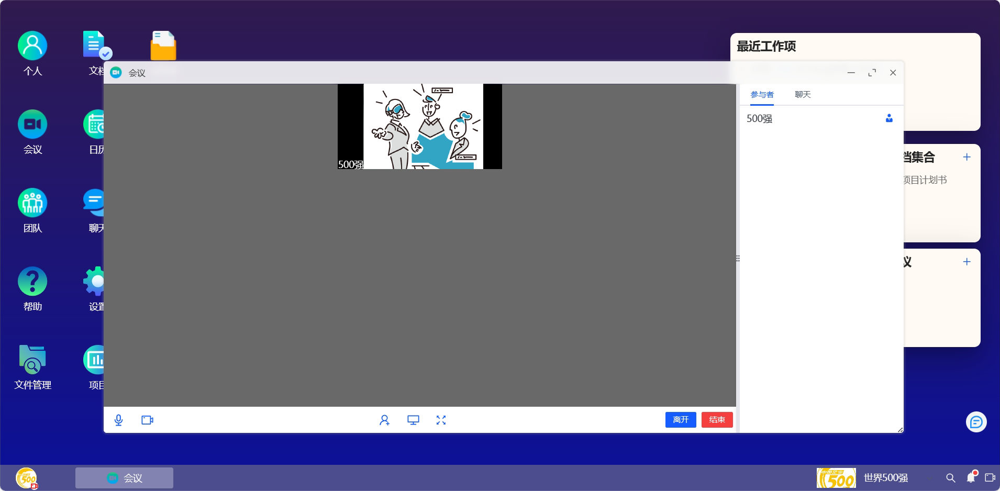

聊天

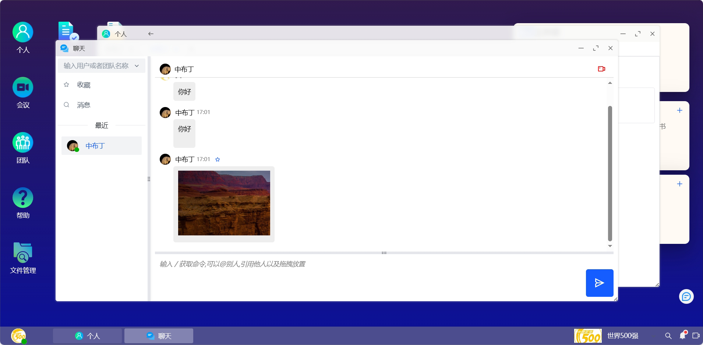

文件管理

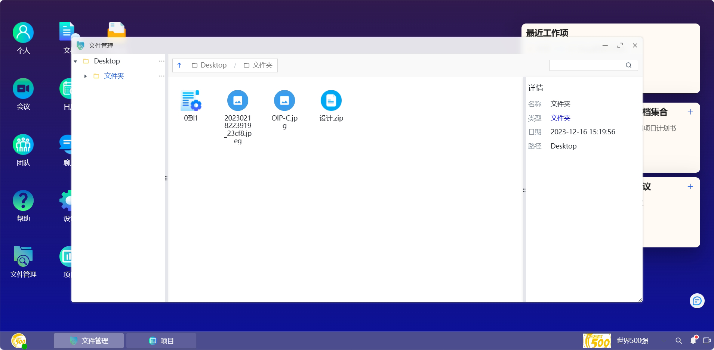

系统

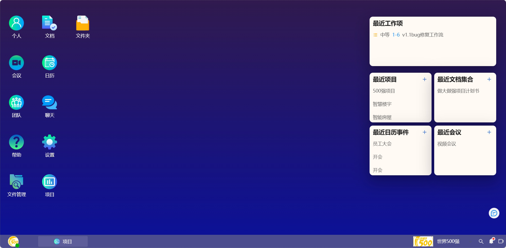

## 🎬 作者

Ansun [[ 网站 ](https://team-linker.com) | [ github ](https://github.com/sx1989827)]

## 📺 使用须知
1、仅允许用于个人学习、毕业设计、教学案例、公益事业、商业使用;

2、如果商用必须保留版权信息，请自觉遵守;

3、禁止将本开源的代码和资源进行任何形式任何名义的出售，否则产生的一切任何后果责任由侵权者自负;

4、本版本源码全部开源; 包括前端，后端，无任何加密;

5、商用请仔细审查代码和漏洞，不得用于任一国家许可范围之外的商业应用，产生的一切任何后果责任自负;

<h4>本系统已申请专利著作权，请不要私自用于商业用途，如有发现，我们将保留对你的法律责任追究！</h4>

## 🔓 License

[ISC](./LICENSE)

## ⚡ 技术交流
QQ交流群

  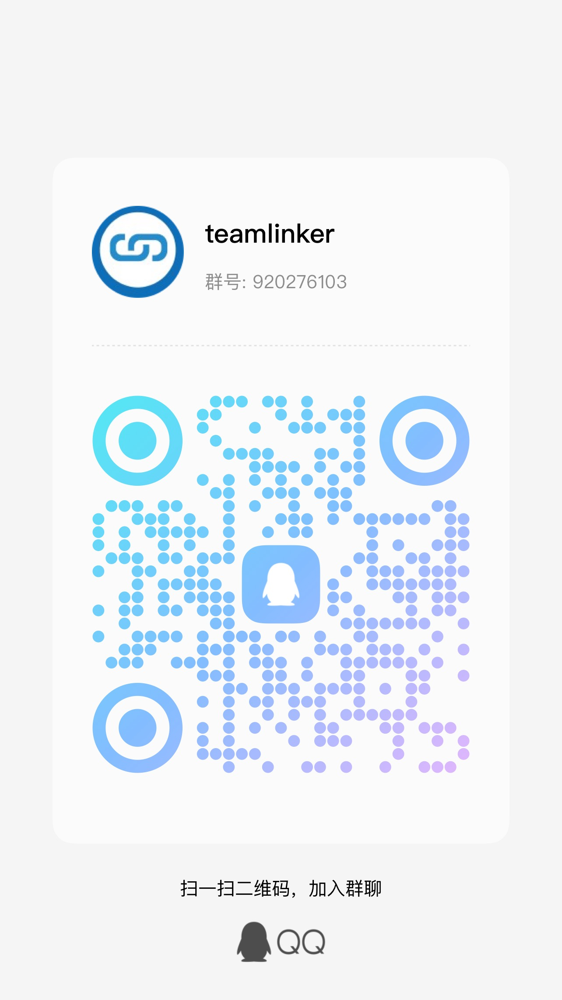

